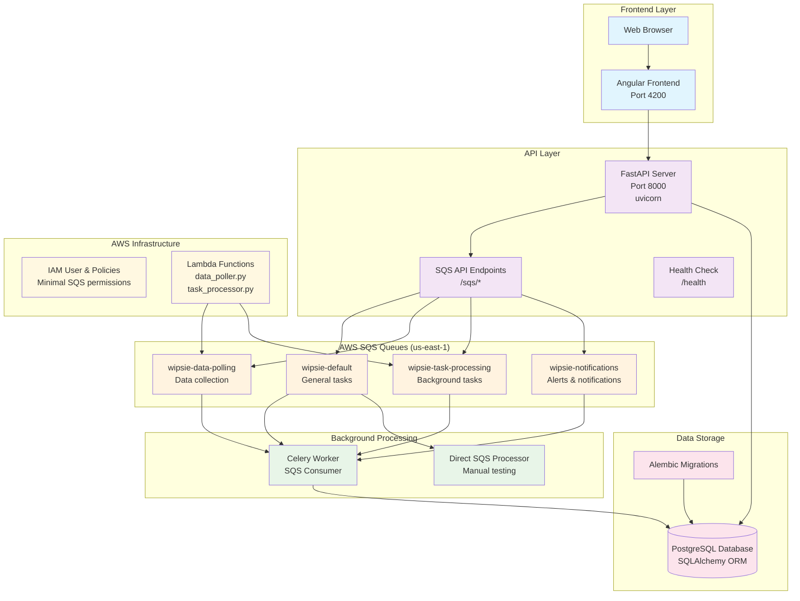
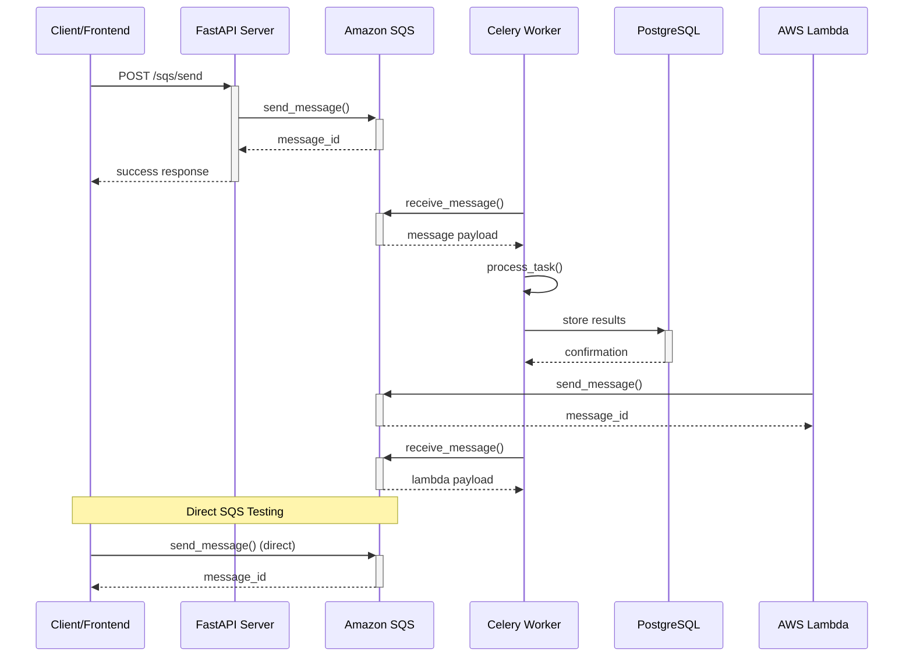
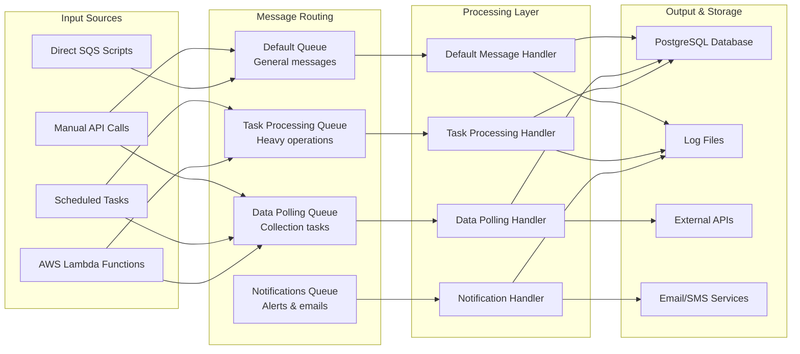
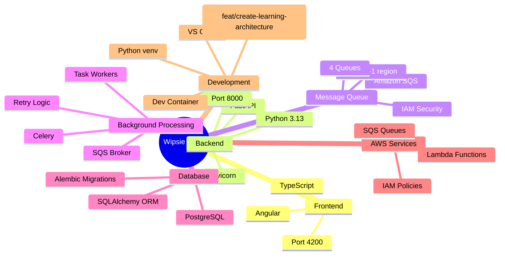
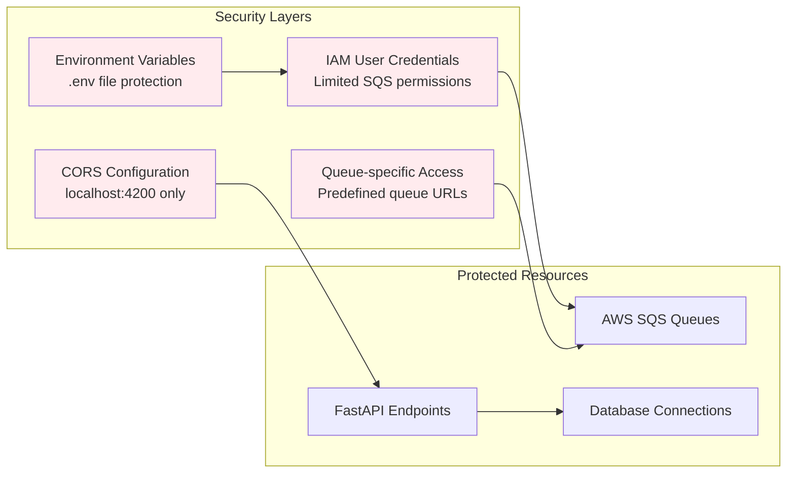

# Wipsie Full Stack Architecture Documentation

## Table of Contents
1. [System Overview](#system-overview)
2. [Component Details](#component-details)
3. [Message Flow Architecture](#message-flow-architecture)
4. [Data Flow Architecture](#data-flow-architecture)
5. [Technology Stack](#technology-stack)
6. [Security Architecture](#security-architecture)
7. [Implementation Status](#implementation-status)
8. [Deployment Guide](#deployment-guide)
9. [Development Workflow](#development-workflow)
10. [Troubleshooting](#troubleshooting)

## Architecture Philosophy

Wipsie follows a **microservices architecture** with **event-driven design** principles:

- **Decoupled Components**: Each service can be developed, deployed, and scaled independently
- **Async Communication**: SQS queues enable resilient, async message processing
- **Cloud-Native**: Built for AWS infrastructure with horizontal scaling capabilities
- **API-First**: RESTful FastAPI backend with clear separation of concerns
- **Security-First**: IAM-based access control with minimal permissions

## System Overview



## Message Flow Architecture



## Data Flow Architecture



## Technology Stack



## Security Architecture



## Current Implementation Status

```mermaid
gitgraph
    commit id: "Initial FastAPI setup"
    commit id: "SQS queue creation"
    commit id: "Environment config"
    branch sqs-integration
    commit id: "SQS service layer"
    commit id: "API endpoints"
    commit id: "Direct SQS testing"
    commit id: "Message sending ✅"
    commit id: "Message receiving ✅"
    checkout main
    merge sqs-integration
    branch worker-setup
    commit id: "Celery worker config"
    commit id: "Task handlers"
    commit id: "Message processor"
    commit id: "Current state 🚧"
```

## Component Details

### Frontend Layer

#### Angular Frontend (Port 4200)
- **Technology**: Angular 18+ with TypeScript
- **Purpose**: User interface for managing tasks, viewing data, and system monitoring
- **Features**:
  - Real-time dashboard showing queue status
  - Task creation and management interface
  - Data visualization and reporting
  - User authentication and authorization
- **Communication**: REST API calls to FastAPI backend
- **Status**: 📋 Planned (not yet implemented)

### API Layer

#### FastAPI Server (Port 8000)
- **Technology**: FastAPI with Python 3.13, uvicorn ASGI server
- **Purpose**: REST API backend providing SQS integration and business logic
- **Key Endpoints**:
  - `GET /` - Welcome message and API info
  - `GET /health` - Health check endpoint
  - `GET /sqs/queues` - List available SQS queues
  - `POST /sqs/send` - Send message to specific queue
  - `GET /sqs/receive/{queue_name}` - Receive messages from queue
  - `POST /sqs/test-message` - Send test message to default queue
  - `DELETE /sqs/message/{queue_name}` - Delete processed message
- **Features**:
  - CORS enabled for localhost:4200
  - Pydantic models for request/response validation
  - Comprehensive error handling
  - SQS service abstraction layer
- **Status**: ✅ Implemented and working

#### SQS Service Layer
- **File**: `backend/services/sqs_service.py`
- **Purpose**: Abstraction layer for Amazon SQS operations
- **Features**:
  - Queue URL management for all 4 queues
  - Message sending with attributes and metadata
  - Message receiving with filtering
  - Automatic timestamp and queue tagging
  - Error handling and retry logic
- **Status**: ✅ Implemented and tested

### Message Queue Layer

#### Amazon SQS Queues (us-east-1)

**1. wipsie-default**
- **Purpose**: General task processing and default message handling
- **Message Types**: API tests, general commands, manual tasks
- **Consumers**: Celery worker, direct processors
- **Visibility Timeout**: 30 seconds
- **Message Retention**: 14 days

**2. wipsie-data-polling**
- **Purpose**: Scheduled data collection and external API polling
- **Message Types**: Data source polling, ETL triggers, scheduled jobs
- **Consumers**: Specialized data polling workers
- **Use Cases**: Database syncing, API data collection, periodic reports

**3. wipsie-task-processing**
- **Purpose**: Heavy computational tasks and background processing
- **Message Types**: Data analysis, report generation, batch processing
- **Consumers**: High-performance worker nodes
- **Use Cases**: ML model training, large data transformations

**4. wipsie-notifications**
- **Purpose**: Alert delivery and communication
- **Message Types**: Email notifications, SMS alerts, system notifications
- **Consumers**: Notification service workers
- **Use Cases**: User alerts, system monitoring, error notifications

### Background Processing Layer

#### Celery Worker
- **File**: `celery_worker.py`
- **Technology**: Celery with SQS broker transport
- **Purpose**: Distributed task processing with automatic scaling
- **Task Types**:
  - `process_default_message()` - Handle general tasks
  - `process_data_polling()` - Execute data collection
  - `process_task()` - Heavy computational work
  - `send_notification()` - Deliver alerts and messages
- **Features**:
  - Automatic retry with exponential backoff
  - Task routing based on message type
  - Comprehensive logging
  - Dead letter queue handling
- **Status**: 🚧 In development

#### Direct SQS Processor
- **File**: `process_messages.py`
- **Purpose**: Manual message processing for testing and debugging
- **Features**:
  - Queue statistics and monitoring
  - Manual message processing
  - Interactive message deletion
  - Development testing capabilities
- **Status**: ✅ Implemented for testing

### Data Storage Layer

#### PostgreSQL Database
- **Technology**: PostgreSQL with SQLAlchemy ORM
- **Purpose**: Persistent data storage for application state
- **Schema**:
  - User management and authentication
  - Task definitions and results
  - System configuration
  - Audit logs and monitoring data
- **Status**: 📋 Schema designed, not yet connected

#### Alembic Migrations
- **Purpose**: Database schema version control
- **Features**: Automated database updates and rollbacks
- **Status**: ✅ Initial migration created

### AWS Infrastructure

#### IAM Security
- **User**: Dedicated SQS user with minimal permissions
- **Policies**: 
  - SQS queue access (send/receive/delete)
  - Regional restriction (us-east-1 only)
  - Resource-specific permissions
- **Credentials**: Environment-based configuration
- **Status**: ✅ Configured and documented

#### Lambda Functions
- **Files**: `aws-lambda/functions/`
  - `data_poller.py` - Scheduled data collection
  - `task_processor.py` - Serverless task execution
- **Purpose**: Serverless message producers and light processing
- **Triggers**: CloudWatch Events, API Gateway, S3 events
- **Status**: 📋 Planned

## Message Patterns and Protocols

### Message Structure
All messages follow a standardized JSON structure:

```json
{
  "id": "uuid4-generated-id",
  "timestamp": "2025-10-04T14:06:02.648981",
  "source": "api_test|lambda|manual",
  "task_type": "data_polling|processing|notification",
  "message": "Human-readable description",
  "queue": "target-queue-name",
  "data": {
    "specific": "task-data",
    "priority": "high|medium|low",
    "retry_count": 0
  }
}
```

### Message Attributes
SQS message attributes provide metadata for routing and processing:

- `source`: Message origin (api, lambda, manual)
- `message_type`: Processing category
- `priority`: Execution priority level
- `queue_name`: Target queue identifier

### Error Handling Strategy

1. **Retry Logic**: Exponential backoff (30s, 60s, 120s)
2. **Dead Letter Queues**: Failed messages after max retries
3. **Error Logging**: Comprehensive error tracking
4. **Circuit Breaker**: Prevent cascade failures
5. **Monitoring**: CloudWatch metrics and alarms

## Development Environment

### Local Development Setup

```bash
# 1. Environment setup
cd /workspaces/wipsie
python -m venv venv
source venv/bin/activate

# 2. Install dependencies
pip install -r requirements.txt

# 3. Environment configuration
cp .env.example .env
# Edit .env with AWS credentials

# 4. Database setup
alembic upgrade head

# 5. Start services
python -m uvicorn backend.main:app --reload --port 8000
celery -A celery_worker worker --loglevel=info
```

### Testing Workflow

```bash
# Test SQS connectivity
python simple_sqs_test.py

# Test API endpoints
curl http://localhost:8000/sqs/queues

# Test message processing
python process_messages.py

# Send test message via API
curl -X POST http://localhost:8000/sqs/test-message
```

## Monitoring and Observability

### Health Checks
- **API Health**: `GET /health` endpoint
- **Queue Monitoring**: Message count and age metrics
- **Worker Status**: Celery worker heartbeat and task completion
- **Database Health**: Connection pool and query performance

### Logging Strategy
- **Structured Logging**: JSON format with correlation IDs
- **Log Levels**: DEBUG (dev), INFO (prod), ERROR (alerts)
- **Log Aggregation**: CloudWatch Logs integration
- **Metrics**: Custom application metrics

### Performance Metrics
- **API Response Time**: P50, P95, P99 latencies
- **Queue Throughput**: Messages per second
- **Task Processing Time**: Average and peak processing duration
- **Error Rates**: Failed requests and task failures

## Scaling Considerations

### Horizontal Scaling
- **API Layer**: Multiple FastAPI instances behind load balancer
- **Worker Layer**: Auto-scaling Celery workers based on queue depth
- **Database**: Read replicas for query performance
- **Queue Management**: Partition strategies for high-volume queues

### Performance Optimization
- **Connection Pooling**: Reuse database and AWS connections
- **Caching Strategy**: Redis for frequent data access
- **Batch Processing**: Group similar tasks for efficiency
- **Resource Limits**: Memory and CPU constraints per service

## Security Considerations

### Network Security
- **VPC Configuration**: Private subnets for backend services
- **Security Groups**: Restrictive ingress/egress rules
- **API Gateway**: Rate limiting and authentication
- **SSL/TLS**: End-to-end encryption

### Data Protection
- **Encryption at Rest**: Database and queue encryption
- **Encryption in Transit**: HTTPS and TLS for all communications
- **Secrets Management**: AWS Secrets Manager for credentials
- **Access Logging**: Audit trail for all data access

### Compliance
- **GDPR Compliance**: Data retention and deletion policies
- **SOC2 Considerations**: Access controls and monitoring
- **PCI DSS**: If handling payment data
- **Data Classification**: Sensitive data identification and handling
